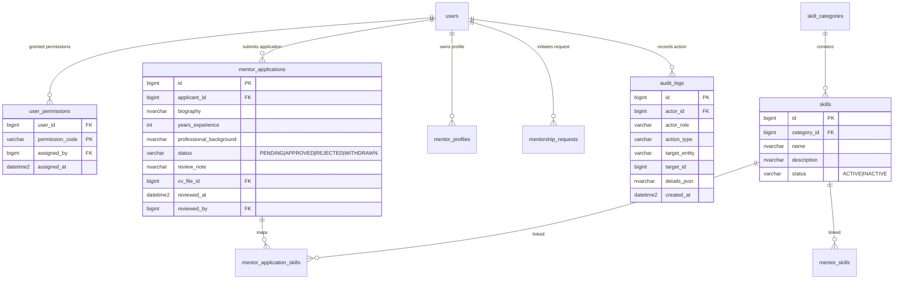

# Feature Specification: Staff Role & Operational Governance (`001-staff-management`)

> **Feature ID:** `001-staff-management`  
> **Document Type:** GitHub Spec Kit Feature Specification (`spec.md`)  
> **Source Material:** [SRS_Group3_HPMS.docx](file:///d:/Happy-Programming-Mentorship-System/SRS_Group3_HPMS.docx) & [specs/SPEC.md](file:///d:/Happy-Programming-Mentorship-System/specs/SPEC.md)  
> **Standard:** [GitHub Spec Kit](https://github.github.io/spec-kit/) / [AGENTS.md](file:///d:/Happy-Programming-Mentorship-System/AGENTS.md)  
> **Version:** 1.0.0  
> **Status:** Approved / Active  

---

## 1. Executive Summary & Intent

The **Staff Role** represents the primary operational and back-office management tier in the HappyProgramming Mentorship Management System (HPMS). While Administrators handle system-wide configuration, financial reporting, and user account provisioning, **Staff Members** own day-to-day platform operations:

1. **Mentor Onboarding & Qualification Moderation**: Reviewing incoming mentor application forms, evaluating professional experience, target skills, and uploaded PDF CV & qualification certificates (up to 10MB), and approving or rejecting candidates.
2. **Mentor Directory Oversight**: Inspecting active mentor profiles, availability settings, and professional credentials for quality control.
3. **Mentee User Management**: Monitoring registered mentee accounts, checking connection request counts, and reviewing user activity history (BR-28).
4. **Mentorship Request Lifecycle Handling**: Monitoring mentorship requests across all states (`PENDING`, `ACCEPTED`, `PAID`, `COMPLETED`, `REJECTED`, `CANCELLED`, `EXPIRED`), evaluating mentee learning goals, and executing manual status transitions for operational support or issue handling (GB-15).
5. **Skill Catalog Management**: Maintaining the master dictionary of technical skills (creating, updating, activating, and deactivating skills), enforcing that only approved active skills are selectable or visible in public discovery (GB-05).
6. **Granular Permission Controls**: Operating under strict Role-Based Access Control (RBAC) governed by 4 fine-grained permission codes (`MENTOR_APPLICATION_MANAGE`, `MENTEE_MANAGE`, `MENTORSHIP_REQUEST_MANAGE`, `SKILL_MANAGE`), ensuring Staff users only execute actions assigned to them by an Administrator (GB-10, GB-14, BR-29).

---

## 2. Stakeholders & User Roles

| Role Code | User Class | Permissions & Scope in Staff Domain |
| :--- | :--- | :--- |
| `STAFF` | Operational Staff | Primary actor. Accesses `/staff/*` back-office management views based on assigned granular permissions. Conducts mentor verification, mentee oversight, request lifecycle management, and skill curation. |
| `ADMIN` | System Administrator | Governance actor. Assigns/revokes granular Staff permissions (`user_permissions`), monitors Staff audit logs (`audit_logs`), and manages Staff account statuses. |
| `MENTOR` | Mentor Applicant / Mentor | Subject of Staff review. Submits CV applications for Staff verification; public profile and teaching skills become discoverable only upon Staff approval (GB-04). |
| `MENTEE` | Registered Mentee | Subject of Staff oversight. Profile data and mentorship request lifecycle can be inspected and updated by authorized Staff for operational support. |

---

## 3. Scope & Feature Breakdown

### 3.1 Staff Dashboard & Live Operational Metrics (UC-STAFF-01)
- **Real-Time Metric Cards**:
  - **Pending Mentor Applications**: Counter showing new mentor applications awaiting Staff verification review.
  - **Active Mentors**: Total count of active, approved mentors registered on the platform.
  - **Active Mentees**: Total count of active mentees registered on the platform.
  - **Pending Requests**: Counter of mentorship requests currently in `PENDING` state.
- **Platform Activity Chart**: Visual bar graph rendering system interaction volume across timeline increments.
- **Recent Staff Activity Ledger**: Live stream listing recent back-office task executions, application approvals, and operational logging records.
- **Portal Navigation Hub**: Left sidebar access to Manager Mentors, Manager Mentees, Manager Requests, Mentor Applications, and Skills List.

### 3.2 Mentor Onboarding & Application Review (UC17, UC18, UC-STAFF-02)
- **Pending Application Queue**: Dedicated queue of submitted applications in `PENDING` state.
- **Verification Workspace**:
  - Personal details: Avatar, Full Name, Email, Phone, Country/Timezone, Social links (LinkedIn, GitHub, Portfolio).
  - Professional summary: Years of experience, primary technical track, bio/mentoring philosophy.
  - Target teaching skills selection.
  - **PDF CV & Certificate Document Viewer**: Secure inline preview and file download of attached CV documents (validated PDF format, maximum 10MB; GB-25).
- **Approval Decision Workflow**:
  - **Approve**: Sets application status to `APPROVED`, promotes applicant user `role_code` from `MENTEE` to `MENTOR`, enables public profile visibility (`is_public = 1`), writes an audit log entry (GB-11), and dispatches an approval email via Gmail API (`API-03`).
  - **Reject**: Sets application status to `REJECTED`, records optional rejection note/reason, writes an audit log entry (GB-11), and dispatches a notification email via Gmail API (`API-03`).

### 3.3 Mentor Directory Oversight (UC19, UC45, UC-STAFF-03)
- **Mentor Search & Filtering**: Search approved mentors by name or email keyword, filter by primary Skill category, and filter by operational Status (`ACTIVE`, `INACTIVE`).
- **Detailed Mentor Inspection**: View mentor profile details, verified skills list, years of experience, service package offerings (Monthly Mentorship, One-Off Sessions), and uploaded CV documents.

### 3.4 Mentee Directory Oversight (UC36, UC46, UC-STAFF-04)
- **Mentee Search & Filtering**: Search student accounts by name or email, filter by account status (`ALL`, `ACTIVE`, `INACTIVE`, `LOCKED`), and sort chronologically by registration date (`Newest` default).
- **Mentee Profile Inspection**: View full name, email, registration timestamp, total cumulative request counters, and active booking history for customer support and issue resolution (BR-28, BR-29).

### 3.5 Mentorship Request Lifecycle Handling (UC37, UC-STAFF-05)
- **Request Ledger Overview**: Unified table of mentorship requests showing Request ID (`RQ-XXXX`), Mentee Name, Mentor Name, Requested Skill, Status (`PENDING`, `ACCEPTED`, `PAID`, `COMPLETED`, `REJECTED`, `CANCELLED`, `EXPIRED`), and Creation Date.
- **Search & Multi-Criteria Filter**: Query requests by Request ID or user name, filter by request state or skill, and sort chronologically.
- **Request Timeline & Detail View**: Deep dive into request details, mentee learning goals description (minimum 50 characters; BR-09), repository/portfolio links, package fee snapshot, and response countdown timers (48-hour SLA; GB-16).
- **Operational Request Status Update**:
  - Enables authorized Staff to update request status during issue resolution, support tickets, or manual interventions.
  - Enforces strict request lifecycle state machine rules (GB-15) and logs all status overrides to `audit_logs` (GB-11).

### 3.6 Programming Skill Catalog Management (UC38, UC11, UC-STAFF-06)
- **Skill Master Directory**: Central table of system programming skills organized by category/domain (e.g. Backend, Frontend, AI/ML, DevOps, Database).
- **Skill Creation & Modification**: Add new skills (Skill Name, Category, Description) or edit existing skill information.
- **Skill Activation Toggle**: Toggle skill operational status between `ACTIVE` and `INACTIVE`.
- **System Rule Enforcement**: Enforces GB-05 (only active skills managed by Staff are publicly visible in mentor discovery and selectable on mentor registration forms).

---

## 4. User Stories & Acceptance Scenarios (Given-When-Then)

### 4.1 Mentor Application Verification

#### US-STAFF-01: Review & Process Mentor Registration Application
- **As a** Staff member with `MENTOR_APPLICATION_MANAGE` permission,  
  **I want to** review a pending mentor application and inspect the applicant's credentials and PDF CV,  
  **So that** I can approve qualified mentors or reject unqualified submissions.

- **Scenario 1: Successful Application Approval**
  - **Given** a mentor application with ID `MA-102` in `PENDING` status,
  - **When** I inspect the applicant details, verify the PDF CV document, and click "Approve Application",
  - **Then** the application status changes to `APPROVED`, the user's role code updates to `MENTOR`, an immutable entry is added to `audit_logs`, and an automated confirmation email is sent to the applicant.

- **Scenario 2: Application Rejection with Rejection Note**
  - **Given** a mentor application where the CV does not meet minimum domain experience,
  - **When** I click "Reject Application" and submit rejection reason "Uploaded CV indicates less than required 3 years of practical experience",
  - **Then** the application status changes to `REJECTED`, the rejection note is stored in `mentor_applications`, an audit log entry is written, and an email notification with the rejection reason is dispatched to the applicant.

- **Scenario 3: File Format & Size Constraint Validation (GB-25)**
  - **Given** an applicant uploaded an invalid or corrupt file,
  - **When** Staff views the application details,
  - **Then** the system validates file metadata (`.pdf`, $\le 10\text{MB}$); if invalid, it highlights the validation error `MSG_INVALID_FILE_FORMAT_OR_SIZE` and prevents system crash.

---

### 4.2 Mentee Management & Support

#### US-STAFF-02: Search & Inspect Mentee Profiles
- **As a** Staff member with `MENTEE_MANAGE` permission,  
  **I want to** search mentees by name/email and view their connection request history,  
  **So that** I can assist with student support inquiries and verify account activity.

- **Scenario 1: Search & Filter Student Directory**
  - **Given** the Manager Mentees page,
  - **When** I enter "Pham Minh Khoa" into the search bar and select status "Active",
  - **Then** the directory table updates to display matching active mentee records.

- **Scenario 2: Inspect Mentee Account Details & Request Counter**
  - **Given** a mentee row in the directory,
  - **When** I click "View Profile",
  - **Then** the system displays full user profile details, email verification status, total submitted connection requests count, and active subscription details.

---

### 4.3 Mentorship Request Monitoring & Operations

#### US-STAFF-03: Monitor & Update Mentorship Request Status
- **As a** Staff member with `MENTORSHIP_REQUEST_MANAGE` permission,  
  **I want to** track mentorship requests and perform status updates when support intervention is required,  
  **So that** mentorship requests adhere to valid platform lifecycle states.

- **Scenario 1: Filter Request Ledger by Request ID**
  - **Given** the Manager Requests portal,
  - **When** I type "RQ-0301" into the Request ID search field,
  - **Then** the table displays request `RQ-0301` along with mentee name, mentor name, skill, current status, and submission timestamp.

- **Scenario 2: Enforce Lifecycle State Machine Transition Guard (GB-15)**
  - **Given** a request `RQ-0245` currently in `PAID` status,
  - **When** Staff attempts an invalid manual status transition (e.g. attempting to move from `PAID` back to `PENDING`),
  - **Then** the backend state machine blocks the update, returns validation error `E2 - Invalid status update`, and leaves the request status unchanged.

- **Scenario 3: Audit Logging of Staff Status Overrides (GB-11)**
  - **Given** a valid status change executed by Staff `user_id = 45` on request `RQ-0245`,
  - **When** the status update succeeds,
  - **Then** the system writes an immutable record to `audit_logs` containing `actor_id=45`, `actor_role='STAFF'`, `action_type='UPDATE_REQUEST_STATUS'`, `target_entity='mentorship_requests'`, and timestamp.

---

### 4.4 Programming Skill Catalog Curation

#### US-STAFF-04: Add & Deactivate System Skills
- **As a** Staff member with `SKILL_MANAGE` permission,  
  **I want to** create new programming skills and deactivate outdated ones,  
  **So that** the platform maintains an accurate tech stack catalog for discovery.

- **Scenario 1: Add New Approved Skill**
  - **Given** the Skills Management view,
  - **When** I enter Skill Name "Spring Boot 3", select category "Software Engineering & Architecture", and click "Add Skill",
  - **Then** the new skill is saved with status `ACTIVE` and immediately becomes selectable on mentor profiles and search filter menus.

- **Scenario 2: Deactivate Deprecated Skill (GB-05)**
  - **Given** an active skill "Obsolete Tech Stack",
  - **When** Staff toggles its status to `INACTIVE`,
  - **Then** the system updates the skill status to `INACTIVE`, hiding it from public mentor discovery and new registration forms while preserving historical records.

---

### 4.5 Granular Authorization & RBAC Enforcement

#### US-STAFF-05: Enforce Staff Granular Permission Matrix
- **As the** System,  
  **I want to** verify user permission codes on every Staff endpoint call,  
  **So that** Staff members can only execute operations explicitly granted to them by an Administrator.

- **Scenario 1: Block Unauthorized Staff Endpoint Execution (GB-14, BR-29)**
  - **Given** a Staff account with ONLY `SKILL_MANAGE` permission,
  - **When** this Staff user attempts to call `/api/v1/staff/mentor-applications/102/approve`,
  - **Then** the backend rejects the call with `403 Forbidden` and error payload `Access denied: Missing MENTOR_APPLICATION_MANAGE permission`.

---

## 5. Global Business Rules (Staff Domain Summary)

| Rule ID | Statement | Enforced At |
| :--- | :--- | :--- |
| **GB-04** | Only active and Staff-approved Mentor profiles (`status='APPROVED'`, `is_public=1`) are publicly visible in discovery. | Database persistence query predicate. |
| **GB-05** | Only active skills managed by Staff (`status='ACTIVE'`) can be attached to profiles or filtered in search. | Relational integrity & service layer filter. |
| **GB-10** | Only Admin users may modify Staff authorization assignments in `user_permissions`. | Backend `@PreAuthorize("hasRole('ADMIN')")`. |
| **GB-11** | All administrative and Staff status updates must be logged in `audit_logs`. | Aspect-oriented audit logging interceptor. |
| **GB-12** | Audit log entries are strictly read-only and immutable. | DB permissions (`INSERT, SELECT` only). |
| **GB-14** | Staff may only execute actions granted by their permission records in `user_permissions`. | Spring Security custom permission evaluator. |
| **GB-15** | Request status changes must strictly follow validated lifecycle state machine transitions. | State machine transition validator service. |
| **GB-25** | Mentor application CV files must be PDF format and strictly $\le 10\text{MB}$ in file size. | Multipart upload validation service. |
| **GB-28** | Staff can view registered mentee and mentor information for operational management purposes. | Read-only repository queries for Staff endpoints. |
| **GB-29** | Staff cannot access or modify information outside the permissions assigned to their Staff role. | Method-level authorization checks. |

---

## 6. Architecture & Data Model

### 6.1 Entity Relationship Diagram (Staff Operations Context)

### 6.2 Granular Permission Matrix (`user_permissions`)

| Permission Code | Description | Authorized Endpoints & UI Views |
| :--- | :--- | :--- |
| `MENTOR_APPLICATION_MANAGE` | Review pending mentor applications, inspect CV PDFs, execute approve/reject. | `/api/v1/staff/mentor-applications/**` UI: `Mentor Applications` view |
| `MENTEE_MANAGE` | View student directory, inspect mentee profile details and connection history. | `/api/v1/staff/mentees/**` UI: `Manager Mentees` view |
| `MENTORSHIP_REQUEST_MANAGE` | View mentorship request ledger, inspect learning goals, execute request status updates. | `/api/v1/staff/requests/**` UI: `Manager Requests` view |
| `SKILL_MANAGE` | Create new skills, edit existing skills, toggle active/inactive status. | `/api/v1/staff/skills/**` UI: `Skills List` view |

---

## 7. Frontend User Interface Specifications

### 7.1 Layout & Navigation (Staff Portal)
- **Top Header**: Staff Portal Branding, Live Notifications Bell, Staff Profile Avatar & Name, Logout action.
- **Left Navigation Menu**:
  - `Dashboard` (`/staff/dashboard`)
  - `Manager Mentors` (`/staff/mentors`)
  - `Manager Mentees` (`/staff/mentees`)
  - `Skills List` (`/staff/skills`)
  - `Mentor Applications` (`/staff/mentor-applications`)
  - `Requests` (`/staff/requests`)
- **Color Palette & Visual Tokens**:
  - Primary Purple: `#8b46e8`
  - Dark Purple: `#7431d0`
  - Ink Accent: `#25143f`
  - Lavender Container: `#f1e8ff`
  - Background: `#fbf9ff`
  - Status Badges:
    - `PENDING`: Amber (`#f59e0b`)
    - `APPROVED` / `ACTIVE` / `PAID` / `COMPLETED`: Green (`#10b981`) or Blue (`#3b82f6`)
    - `REJECTED` / `CANCELLED` / `EXPIRED` / `LOCKED`: Red (`#ef4444`)

---

## 8. Non-Functional Requirements (NFRs)

### 8.1 Performance & Scalability
- **Page TTI**: Staff dashboard and listing tables TTI $< 1.5\text{s}$ over 4G connections.
- **Query Performance**: Database searches across 10,000+ records respond within $< 250\text{ms}$.
- **Document Viewing**: PDF CV file previews render within $< 2.0\text{s}$.

### 8.2 Security & Compliance
- **Server-Side Authorization**: Endpoints strictly enforce permissions server-side (`@PreAuthorize`).
- **Audit Integrity**: 100% of Staff mutations written synchronously to immutable `audit_logs`.
- **Upload Security**: PDF CV uploads verified by MIME header (`application/pdf`) and size limit ($10\text{MB}$).

---

## 9. Definition of Done & Verification Criteria

- [x] SRS document analyzed for Staff role requirements across use cases, business flows, and schema tables.
- [x] Feature specification `specs/001-staff-management/spec.md` created adhering to GitHub Spec Kit and `AGENTS.md`.
- [ ] Backend REST controllers `/api/v1/staff/**` implemented and verified with integration tests.
- [ ] Frontend Staff Portal views (`/staff/*`) constructed and connected via `services/apiClient.js`.
- [ ] Audit logging for all Staff actions verified against `audit_logs` table.
