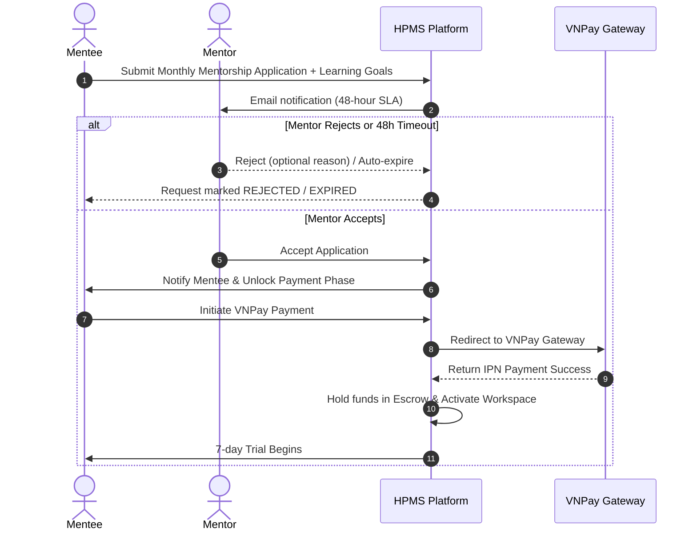

# System Specification: HappyProgramming Mentorship Management System (HPMS)

> **Document Type:** GitHub Spec Kit Product Specification (`spec.md`)  
> **Source Material:** [SRS_Group3_HPMS.docx](file:///d:/Fall2026/SWP/HappyProgramming/SRS_Group3_HPMS.docx)  
> **Standard:** [GitHub Spec Kit](https://github.com/github/spec-kit) / [AGENTS.md](file:///d:/Fall2026/SWP/HappyProgramming/AGENTS.md)  
> **Version:** 1.0.0 (Comprehensive Baseline)  
> **Status:** Approved / Active

---

## 1. Executive Summary & Vision

**HappyProgramming** is a dedicated web-based mentorship platform that connects aspiring developers ("Mentees") with vetted, experienced software engineers ("Mentors"). The platform facilitates high-impact 1-on-1 monthly mentorship, targeted one-off code reviews, structured study roadmaps, portfolio critiques, integrated communication workspaces, and secure VNPay-backed Escrow payments.

The system enforces rigorous quality control through Staff approval of mentors, comprehensive audit logging, automated background jobs, and transparent escrow protection for all monetary transactions.

---

## 2. User Roles & Stakeholder Personas

| Role | Type | Primary Responsibilities & Permissions |
| :--- | :--- | :--- |
| **Guest** | Unauthenticated | Explores public mentor directories and active technical skills; views verified reviews; registers as a Mentee or submits a 3-step Mentor application. |
| **Mentee** | Authenticated Client | Searches/filters mentors; applies for monthly mentorship with learning goals; books 1-on-1 sessions; pays via VNPay; collaborates in private workspaces; rates mentors. |
| **Mentor** | Authenticated Provider | Manages profile, CV, and active teaching skills; reviews incoming requests (accept/reject within 48h); conducts sessions; monitors net earnings and mentee reviews. |
| **Staff** | Operational Internal | Reviews and approves/rejects mentor applications and CVs; moderates mentee accounts and mentorship requests; manages global active technical skills. |
| **Admin** | System Administrator | Manages user accounts and staff role authorizations; configures system parameters and commission rates; inspects audit logs and aggregates financial revenue reports. |

### External Systems & Integrations
- **VNPay Payment Gateway (API-01)**: Processes cashless transactions, handles IPN webhooks, secures escrow deposits, and issues authorized refunds.
- **Google OAuth2 (API-02)**: Enables frictionless third-party authentication for Mentees and Mentors.
- **Email Service / Gmail SMTP (API-03)**: Delivers transactional notifications, account verifications (15-min OTP/link expiry), booking reminders, and request status changes.

---

## 3. Core Business Workflows

### 3.1 Mentorship Booking & Escrow Process

### 3.2 Mentor Onboarding & Approval Process
1. **Application Submission (Guest)**: Submits 3-step application (Personal info, Technical category/skills/bio/socials, Experience & PDF CV/Certificates up to 10MB). Application saved as `PENDING`.
2. **Staff Review (Staff)**: Staff inspects profile, verifies credentials, and issues `APPROVED` or `REJECTED` decision with feedback.
3. **Public Activation**: Only `APPROVED` mentors with `ACTIVE` status appear in public discovery.

### 3.3 Rating & Feedback Process
- Mentees can submit a 1–5 star rating and descriptive commentary **only after** a session or monthly mentorship cycle is officially completed (`COMPLETED` status).

---

## 4. User Stories & Acceptance Scenarios (Given-When-Then)

### 4.1 Authentication & Account Management

#### US-01: Mentee Registration
- **As a** Guest,  
  **I want to** register for a Mentee account using my email or Google OAuth2,  
  **So that** I can apply for mentorship and book sessions.
- **Scenario 1: Successful Email Registration**
  - **Given** I am on the sign-up page,
  - **When** I provide a valid first name, last name, unique email, and a password (min 8 chars, 1 uppercase, 1 number, 1 special char),
  - **Then** the system creates my account with `PENDING_VERIFICATION` status and sends a 15-minute verification link to my email.
- **Scenario 2: Duplicate Email Rejection**
  - **Given** an account already exists with `alice@example.com`,
  - **When** a user attempts to register with `alice@example.com`,
  - **Then** the system rejects the submission with validation error `MSG_EMAIL_EXISTS`.

#### US-02: Role-based Sign In
- **As a** registered user,  
  **I want to** select my role tab ("I'm a mentee" / "I'm a mentor") and sign in,  
  **So that** I am routed to my relevant workspace.
- **Scenario 1: Locked Account Prevention**
  - **Given** an account has experienced 5 consecutive failed login attempts,
  - **When** a 6th login attempt occurs,
  - **Then** the account is locked for 15 minutes and displays a security lockout message.

---

### 4.2 Mentor Discovery & Search

#### US-03: Search & Filter Mentors
- **As a** Mentee or Guest,  
  **I want to** search mentors by skill keyword and filter by category,  
  **So that** I can quickly find the exact expert I need.
- **Scenario 1: Filter by Tech Category & Chevrons**
  - **Given** the homepage category track with 9 curated tracks,
  - **When** I click "Engineering Mentors",
  - **Then** the mentor directory filters to display only approved mentors offering software engineering roles.
- **Scenario 2: Empty Search Result**
  - **Given** I search for an unknown query "NonExistentStack123",
  - **When** no active mentor matches,
  - **Then** the system displays the canonical Empty State with a "Clear filters" action button.

#### US-04: Mentor Profile & Verified Reviews
- **As a** Mentee,  
  **I want to** view a mentor's complete biography, skill badges, pricing plans, and verified mentee reviews,  
  **So that** I can assess their fit before applying.
- **Scenario 1: Inspect Ratings**
  - **Given** mentor "Minh An Nguyen" has 12 completed sessions,
  - **When** I inspect his profile reviews,
  - **Then** I see the 4.9 average score and paginated review cards showing verified package types and dates.

---

### 4.3 Mentorship Applications, Booking & Escrow

#### US-05: Apply for Monthly Mentorship
- **As a** Mentee,  
  **I want to** submit my learning goals and current experience level to a chosen mentor,  
  **So that** they can evaluate if they can support my learning.
- **Scenario 1: Single Pending Application Rule (GB-06)**
  - **Given** I already have an active `PENDING` application with Mentor A,
  - **When** I attempt to submit a second application to Mentor A,
  - **Then** the system blocks the action and prompts me that an application is already awaiting response.
- **Scenario 2: 48-Hour Mentor Response Window (GB-16)**
  - **Given** a monthly application submitted at `T = 0`,
  - **When** `T > 48 hours` and the mentor has neither accepted nor rejected,
  - **Then** Background Job `JOB-02` automatically updates the request to `EXPIRED` and notifies both parties.

#### US-06: VNPay Payment & Escrow Protection (GB-07, GB-08, GB-17)
- **As a** Mentee with an accepted application,  
  **I want to** complete payment securely via VNPay,  
  **So that** my funds are safely held in escrow and my workspace is unlocked.
- **Scenario 1: Successful Payment Callback**
  - **Given** an accepted application awaiting payment,
  - **When** VNPay returns payment code `00` (Success),
  - **Then** the system marks the booking `ACTIVE`, deposits the fee into Escrow, records an audit log, and starts the 7-day trial.
- **Scenario 2: 7-Day Trial Refund**
  - **Given** a Mentee within day 1 to 7 of their paid monthly cycle,
  - **When** the Mentee cancels the mentorship,
  - **Then** access is terminated immediately and a 100% refund is initiated via VNPay gateway.

---

### 4.4 Mentorship Workspace & Communication

#### US-07: Direct Messaging & Code Review
- **As a** Mentee or Mentor with an active booking,  
  **I want to** chat in real-time and share code snippets,  
  **So that** we can collaborate without off-platform leakage.
- **Scenario 1: Off-Platform Contact Detection**
  - **Given** an active workspace chat,
  - **When** a user types raw phone numbers or external payment solicitations,
  - **Then** the platform issues a warning toast reminding them of conduct policy.

---

### 4.5 Mentor Workspace & Operations

#### US-08: Mentor Application & Credential Upload
- **As a** prospective mentor,  
  **I want to** complete the 3-step onboarding flow and attach my PDF CV (up to 10MB),  
  **So that** Staff can verify my expertise.
- **Scenario 1: File Constraints Validation**
  - **Given** the Step 3 CV upload dropzone,
  - **When** an applicant uploads a file of type `.exe` or size `> 10MB`,
  - **Then** the upload is rejected with `MSG_INVALID_FILE_FORMAT_OR_SIZE`.

#### US-09: Net Earnings & Commission Tracking
- **As a** Mentor,  
  **I want to** view my gross earnings, platform commission deductions, and net payouts,  
  **So that** I have full visibility into my earnings.
- **Formula:** $\text{Net Earnings} = \text{Gross Revenue} - (\text{Gross Revenue} \times \text{Commission Rate})$.

---

### 4.6 Staff & Admin Governance

#### US-10: Staff Mentor Moderation
- **As a** Staff member,  
  **I want to** review pending mentor applications, inspect their uploaded CV PDFs, and approve or reject them,  
  **So that** only qualified mentors can mentor on HappyProgramming.
- **Scenario 1: Mentor Approval**
  - **Given** a mentor application in `PENDING` state,
  - **When** Staff approves the application,
  - **Then** the mentor's status changes to `APPROVED`, an email notification is dispatched, and their profile becomes discoverable.

#### US-11: Admin Audit Logging & System Configuration (GB-11, GB-12)
- **As an** Admin,  
  **I want to** inspect immutable audit logs and adjust commission percentages,  
  **So that** the platform remains traceable and commercially balanced.
- **Scenario 1: Audit Log Immutability**
  - **Given** the Admin Audit Log view,
  - **Then** all log entries are strictly read-only, displaying timestamp, actor ID, action type, IP address, and target entity.

---

## 5. Global Business Rules (GB-01 to GB-18)

| ID | Business Rule Statement | Enforcement Layer |
| :--- | :--- | :--- |
| **GB-01** | Each email address may be associated with only one HappyProgramming account. | Backend database unique constraint + service validation. |
| **GB-02** | Passwords must be $\ge 8$ characters, including at least 1 uppercase letter, 1 number, and 1 special symbol. | Client & Backend Bean Validation. |
| **GB-03** | Account verification tokens and password reset OTPs expire strictly after 15 minutes. | Background TTL + Redis/DB timestamp check. |
| **GB-04** | Only active and Staff-approved Mentor profiles are publicly visible in discovery. | Persistence query predicate (`status = 'APPROVED' AND active = true`). |
| **GB-05** | Only active skills managed by Staff may be attached to mentor profiles. | Relational foreign key check + active status filter. |
| **GB-06** | A Mentee cannot have multiple concurrent pending applications with the same Mentor. | Composite uniqueness validation on `(mentee_id, mentor_id, status='PENDING')`. |
| **GB-07** | Payment for monthly mentorship is enabled strictly after Mentor approval. | State machine constraint (`request_status == ACCEPTED`). |
| **GB-08** | VNPay payment verification must succeed before workspace activation. | IPN webhook verification + cryptographic hash check. |
| **GB-09** | Reviews may only be submitted by Mentees with completed bookings. | Service authorization check on verified booking records. |
| **GB-10** | Only Admin may modify Staff authorization and role permissions. | Spring Security `@PreAuthorize("hasRole('ADMIN')")`. |
| **GB-11** | All administrative actions, status changes, and configurations must be audited. | Aspect-oriented audit logging interceptor (`AuditLogService`). |
| **GB-12** | Audit log records are strictly immutable and read-only. | Database permissions: `INSERT, SELECT` only (no `UPDATE` or `DELETE`). |
| **GB-13** | Revenue reports count only verified, completed VNPay transactions. | Financial aggregation query filtering `payment_status = 'SUCCESS'`. |
| **GB-14** | Staff may only perform actions permitted by their assigned authorization matrix. | Fine-grained permission evaluations. |
| **GB-15** | Request status changes must strictly follow validated lifecycle state machines. | State machine transition guards. |
| **GB-16** | Mentor must accept or reject an application within 48 hours of submission. | Scheduled background job (`JOB-02`) auto-expiry. |
| **GB-17** | Paid funds are held in Escrow until engagement completion or refund expiry. | Escrow ledger balance management. |
| **GB-18** | Incomplete payment sessions exceeding 15 minutes are automatically expired. | Scheduled payment cleaner job (`JOB-02`). |

---

## 6. Background Jobs Inventory

| Job ID | Job Name | Frequency | Target & Behavior |
| :--- | :--- | :--- | :--- |
| **JOB-01** | `AuditLogCleanupJob` | Daily at 02:00 UTC | Archives or purges audit logs older than retention policy (e.g., 365 days). |
| **JOB-02** | `RequestAndPaymentExpiryJob` | Every 5 minutes | Automatically expires pending applications older than 48 hours (GB-16) and uncompleted VNPay checkout sessions older than 15 minutes (GB-18). |

---

## 7. Non-Functional Requirements & Success Criteria

### 7.1 Performance & Responsiveness
- **Page Load Time**: Core screens must achieve Time-To-Interactive (TTI) $< 2.0\text{s}$ over standard 4G connections.
- **API Latency**: $95\%$ of REST endpoints must respond within $< 300\text{ms}$.
- **Throughput**: Support at least 500 concurrent active users without degradation.

### 7.2 Security & Data Privacy
- Passwords hashed using **BCrypt** (work factor 12).
- Zero raw secrets or VNPay secret keys committed to source code.
- Role-based server-side authorization on all private endpoints.
- All file uploads restricted to `.pdf` for documents and `.jpg`/`.png` for portraits, validated by MIME signature, max 10MB.
- SQL Injection protection via JPA parameterized queries.

### 7.3 Design System & Accessibility
- Canonical color scheme: Primary Purple (`#8b46e8`), Dark Purple (`#7431d0`), Ink (`#25143f`), Lilac (`#f1e8ff`), Cream (`#fbf9ff`).
- Desktop web layout is the delivery target. Existing responsive CSS may remain, but mobile/tablet-specific screen implementation and viewport validation are out of scope unless explicitly requested.
- WCAG 2.1 Level AA conformance (sufficient contrast ratios, semantic HTML, visible focus states).

---

## 8. Canonical Database Schema (31 Tables - Approval-First Revision)

The complete SQL Server schema script is maintained at [`docs/database/init/schema_31_tables.sql`](file:///d:/Fall2026/SWP/HappyProgramming/docs/database/init/schema_31_tables.sql).

### 8.1 Domain Table Mapping (31 Tables)
1. **Identity & Access (4 tables):** `users`, `user_permissions`, `auth_identities`, `security_tokens`
2. **Mentors & Profiles (7 tables):** `mentor_profiles`, `files`, `mentor_applications`, `skill_categories`, `skills`, `mentor_application_skills`, `mentor_skills`
3. **Offerings & Requests (4 tables):** `service_offerings`, `wishlists`, `mentorship_requests`, `mentorship_request_skills`
4. **Scheduling & Subscriptions (4 tables):** `availability_rules`, `availability_exceptions`, `slot_holds`, `subscriptions`
5. **Bookings & Engagement (2 tables):** `bookings`, `action_items`
6. **Finance & Escrow (4 tables):** `payments`, `payment_events`, `refunds`, `escrow_ledger_entries`
7. **Communication & Feedback (3 tables):** `conversations`, `messages`, `reviews`
8. **Platform & Governance (3 tables):** `attachments`, `system_configs`, `audit_logs`

### 8.2 Approval-First Monthly Mentorship State Machine
1. **Submit Application:** Mentee submits application $\rightarrow$ `status=PENDING`, `submitted_at=UTC`, `response_deadline=DATEADD(HOUR, 48, @now)`, `funded_at=NULL`. No payment row created.
2. **Mentor Review (Within 48h):** Mentor reviews request $\rightarrow$ `status=ACCEPTED` or `REJECTED`, `responded_at=UTC`. No payment, escrow, subscription, or workspace activation occurs upon acceptance.
3. **Checkout Initiation (Accepted Only):** Mentee clicks to pay $\rightarrow$ `payments(request_id, billing_cycle_no=1, status=PENDING, expires_at=DATEADD(MINUTE, 15, @now))`. `commission_rate_snapshot` copied from `system_configs('finance.commission_rate')`.
4. **Verified VNPay Callback (Single Atomic Transaction):**
   - Locks `mentorship_requests` (`UPDLOCK, HOLDLOCK`), then payment, then ledger.
   - `payments.status = SUCCEEDED`, `paid_at = gateway_timestamp`.
   - Insert original escrow `HOLD` into `escrow_ledger_entries` (unique idempotency key).
   - Set `mentorship_requests.funded_at = payment.paid_at` (retains `ACCEPTED`).
   - Set initial payment billing dates `[@activation, DATEADD(MONTH, 1, @activation)]`.
   - Insert `subscriptions(status='TRIALING', activated_at=@activation, trial_ends_at=DATEADD(DAY, 7, @activation))`.
   - Create/reuse `conversations`; authorize workspace access by active subscription.
5. **Payment Failure / Expiry:** Only the payment row transitions to `FAILED` or `EXPIRED`. Mentorship request remains `ACCEPTED`, allowing retry with a new attempt reference.
6. **Review Timeout / Unpaid Cancellation:**
   - Pending requests exceeding 48 hours $\rightarrow$ `EXPIRED` (`JOB-02`). No refund needed (no funds collected).
   - Cancel accepted unpaid request $\rightarrow$ close pending payment attempts before setting request to `CANCELLED`.
7. **Paid Cancellation (7-Day Trial Window):** Mentee cancels during trial $\rightarrow$ `subscriptions.status = CANCELLED`, issuance of 100% refund via `refunds` table and `escrow_ledger_entries` with `REFUND_OUT`.
8. **Trial Progression:** After 7 days, background job transitions eligible `TRIALING` subscription to `ACTIVE`. Renewal charges apply to `subscriptions` with `billing_cycle_no >= 2`.

---

## 9. Definition of Done & Traceability

A feature is considered **Done** under this specification when:
1. All acceptance scenarios under Section 4 pass manual and automated verification.
2. Backend REST endpoints are covered by MockMvc integration tests and adhere to [ApiResponse.java](file:///d:/Fall2026/SWP/HappyProgramming/backend/src/main/java/vn/happyprogramming/common/ApiResponse.java).
3. Database migrations represent the 31 persistent entities without manual schema divergence.
4. Frontend components are showcase-tested in `#/components` and connect via `services/apiClient.js`.
5. Business rules (GB-01 to GB-18) and the Approval-First state machine are strictly enforced in backend services and database triggers.
